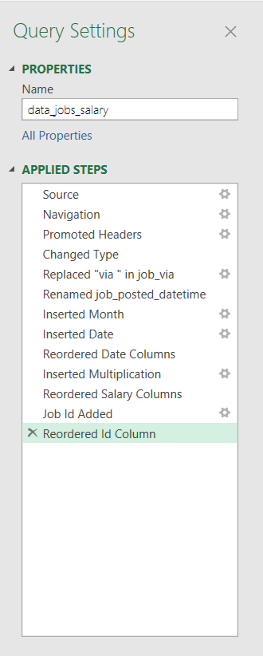
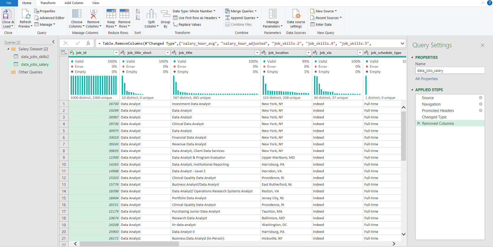
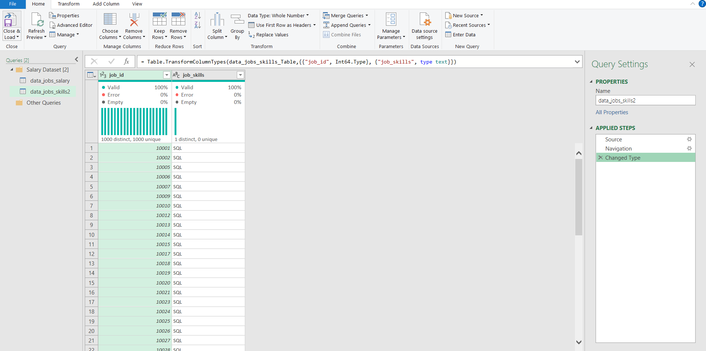
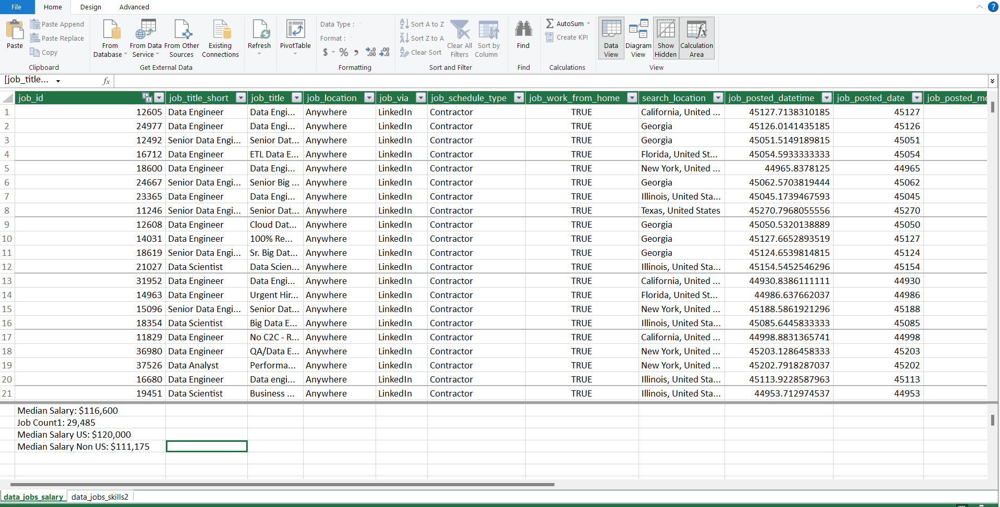
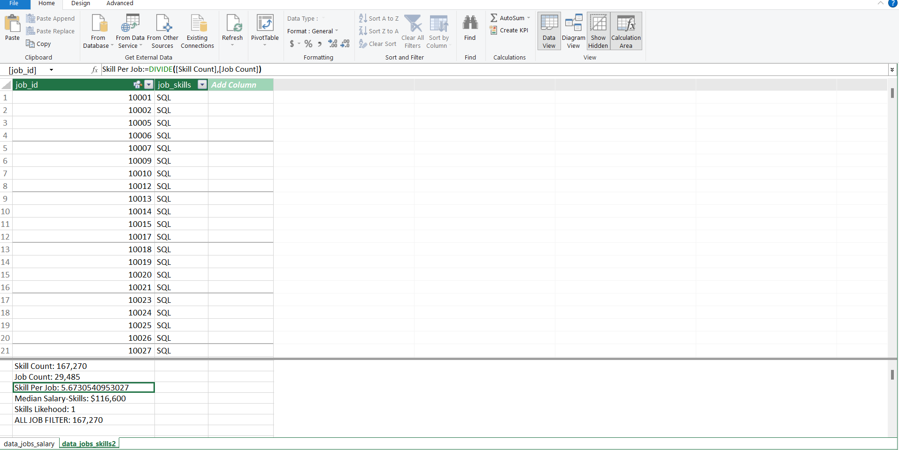
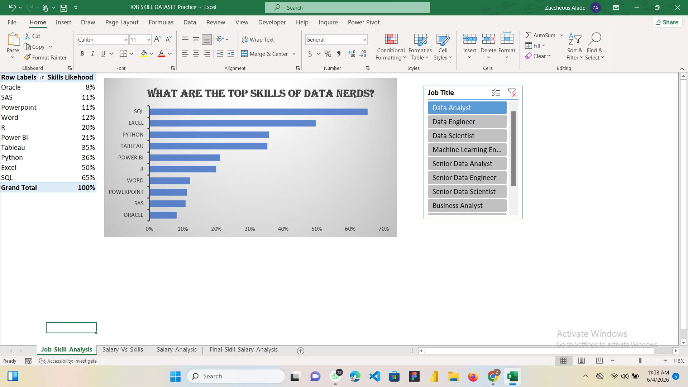
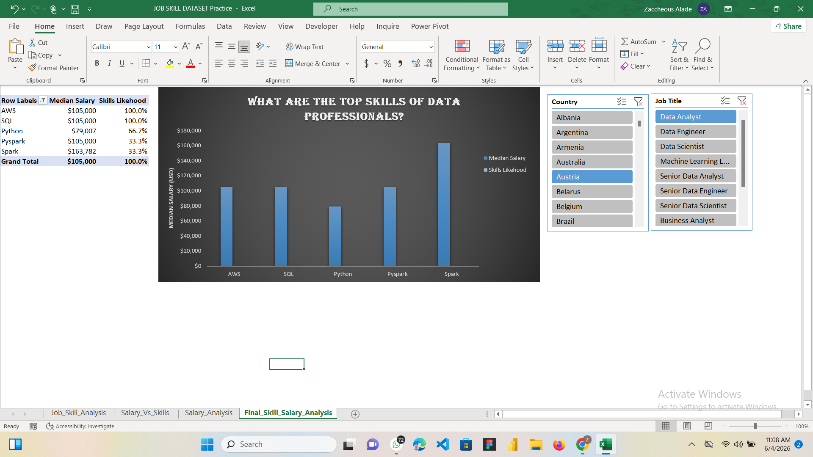
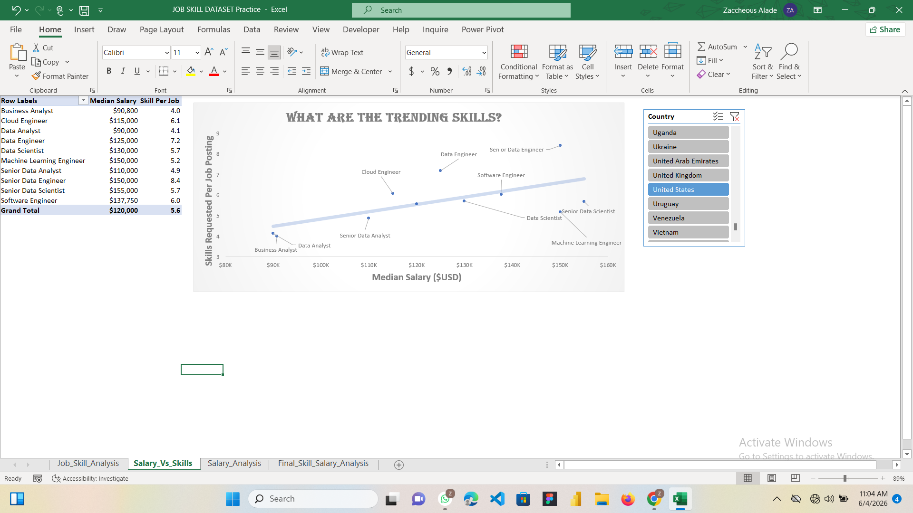

# Job Skills & Salary Analysis

## Introduction

As an aspiring Data Analyst, I wanted to better understand the relationship between skills, salaries, and job opportunities in the data industry. Using Microsoft Excel, I analyzed job postings to identify the most in-demand skills, compare salaries across roles, and determine which technical skills are associated with higher compensation.

This project demonstrates how Excel can be used as a complete analytics platform by combining Power Query, Power Pivot, DAX, Pivot Tables, and Pivot Charts to transform raw data into actionable insights.

### Questions to Analyze

To better understand the data job market, I explored the following questions:

1. **What are the most in-demand skills for Data Analysts?**
2. **How do salaries vary across different data roles?**
3. **Which skills are associated with higher salaries?**
4. **How do salary trends differ across countries and job titles?**

### Excel Skills Used

The following Excel skills were utilized during this project:

* 📊 Pivot Tables
* 📈 Pivot Charts
* 🧮 DAX (Data Analysis Expressions)
* 🔍 Power Query
* 💪 Power Pivot
* 🎛️ Interactive Slicers

### Dataset

The dataset contains job posting information from data-related professions.

The data includes:

* 👨‍💼 Job Titles
* 💰 Salary Information
* 📍 Countries and Locations
* 🛠️ Technical Skills
* 🏢 Work Arrangements
* 📅 Posting Information

# 🧹 Data Preparation

## 🔍 Skill: Power Query (ETL)

### 📥 Extract

The first step in this project was importing the raw job market dataset into Power Query for data preparation and transformation.

To support the analysis, I created two separate queries:

* 🗃️ **data_jobs_salary** containing job information such as job title, salary, location, and country.
* 🔧 **data_jobs_skills2** containing the skills associated with each job posting.

### 📸 Extract Phase


 

---

### 🔄 Transform

After importing the data, I performed several transformation and cleaning steps to improve data quality and prepare the dataset for analysis.

The transformations included:

* Changing incorrect data types
* Removing unnecessary columns
* Trimming excess whitespace
* Standardizing text fields
* Reviewing missing values
* Checking duplicate records
* Preparing tables for data modeling

These transformations ensured that the data was clean, consistent, and ready for analysis.

### 📸 Transform Phase

 
## Transform Skills Data
 
 
---

### 🔗 Load

Once the data was cleaned and transformed, both queries were loaded into Excel and added to the Data Model.

Loading the tables into the Data Model allowed me to create relationships between datasets and perform advanced analysis using Power Pivot, DAX Measures, Pivot Tables, and Pivot Charts.

### 📸 Load Phase





--

### 🤔 So What

Data preparation is one of the most important stages of any analytics project.

Using Power Query allowed me to automate the Extract, Transform, and Load (ETL) process, improve data quality, and create a structured foundation for all subsequent analysis. By building clean datasets and loading them into the Data Model, I was able to perform more accurate analysis and develop interactive dashboards that answer key questions about the data job market.


# 1️⃣ What are the most in-demand skills for Data Analysts?

## 🔧 Skill: Power Pivot

### 💪 Power Pivot

To analyze the most requested skills, I built a data model by connecting job posting information with the skills dataset using the `job_id` field.

### 🔗 Data Model

The relationship was created between:

* `data_jobs_salary`
* `data_jobs_skills2`

Using:

```text
job_id
```

This allowed skills and salary information to be analyzed together within the same model.

### 🧮 DAX Measure

To calculate skill demand, I created a measure that calculates skill likelihood across job postings.

### 📊 Analysis

#### 💡 Insights

* SQL was the most requested skill, appearing in approximately 65% of Data Analyst job postings.
* Excel appeared in 50% of postings, demonstrating its continued importance in analytics workflows.
* Python appeared in approximately 36% of postings.
* Tableau and Power BI were among the most requested business intelligence tools.
* Communication and reporting tools such as Word and PowerPoint still appeared in job requirements.



#### 🤔 So What

Professionals entering the data industry should prioritize SQL, Excel, Python, and visualization tools because these skills consistently appear across a large percentage of job opportunities.

--

# 2️⃣ How do salaries vary across different data roles?

## 🧮 Skills: Pivot Tables & DAX

### 📊 Pivot Table

Using the Power Pivot Data Model, I created a Pivot Table that compares salaries across multiple data-related job titles.

### 🧮 DAX Measures

Median Salary

```DAX
Median Salary :=
MEDIAN('data_jobs_salary'[salary_year_avg])
```

Median Salary US

```DAX
Median Salary US :=
CALCULATE(
    MEDIAN('data_jobs_salary'[salary_year_avg]),
    'data_jobs_salary'[job_country]="United States"
)
```

Median Salary Non-US

```DAX
Median Salary Non US :=
CALCULATE(
    MEDIAN('data_jobs_salary'[salary_year_avg]),
    'data_jobs_salary'[job_country]<>"United States"
)
```

### 📊 Analysis

#### 💡 Insights

* Senior Data Scientist roles recorded some of the highest salaries in the dataset.
* Senior Data Engineer positions also demonstrated strong earning potential.
* Machine Learning Engineers consistently ranked among the highest-paid roles.
* Data Analysts and Business Analysts earned lower median salaries compared to specialized technical positions.
* Salary differences were observed between US and Non-US markets.


#### 🤔 So What

The results show that specialization and seniority significantly impact earning potential within the data industry.

---

# 3️⃣ Which skills are associated with higher salaries?

## 📈 Skill: Pivot Charts

### 📊 Pivot Chart

I created a Pivot Chart to compare skill demand against median salary.

The chart combines:

* Median Salary
* Skill Likelihood

allowing both demand and compensation to be evaluated simultaneously.

### 📊 Analysis

#### 💡 Insights

* Spark generated the highest median salary among the analyzed skills.
* AWS maintained both strong demand and competitive salaries.
* SQL demonstrated exceptional value due to its combination of demand and compensation.
* Python continued to appear across multiple high-paying roles.



#### 🤔 So What

While foundational skills remain essential, specialized technologies such as Spark and cloud platforms can significantly increase earning potential.

--

# 4️⃣ How do salary trends differ across countries and job titles?

## 🎛️ Skill: Interactive Slicers

### 🎛️ Slicers

Interactive slicers were added for:

* Country
* Job Title

This allows users to dynamically filter the dashboard and compare salary patterns across different locations and professions.

### 📊 Analysis

#### 💡 Insights

* Salary trends vary considerably across countries.
* Higher-paying technical roles remain consistent regardless of location.
* Certain countries offer stronger compensation for specialized technical skills.



#### 🤔 So What

Interactive filtering helps uncover market-specific trends that can support career planning and salary negotiations.

--

# Conclusion

Through this project, I transformed raw job posting data into an interactive analytical dashboard using Microsoft Excel.

The analysis revealed that:

* SQL remains the most valuable foundational skill for data professionals.
* Excel continues to be a core requirement for analyst positions.
* Python remains one of the most versatile technical skills.
* Senior and specialized roles command the highest salaries.
* Technologies such as Spark and AWS are associated with strong compensation potential.
This project reflects a practical exploration of the data science job market, built entirely through Excel-based data analysis techniques. By working with real-world job posting data, I examined how job roles, locations, salary structures, and technical skill requirements interact to shape hiring trends in the industry.

Using Power Query for data transformation, PivotTables for aggregation, DAX for calculated insights, and visual dashboards for interpretation, I converted raw, unstructured data into clear, actionable intelligence. The analysis consistently highlighted a strong correlation between higher salary bands and proficiency in core technical skills such as Python, SQL, and cloud technologies.

Beyond visualization, this project demonstrates an end-to-end analytical workflow—from data cleaning to insight generation mirroring real world business analysis processes. It reinforces the importance of structured data handling and critical thinking in deriving meaningful conclusions from complex datasets.

Ultimately, this work serves as a foundation for understanding how data-driven decisions are made in the tech job market and showcases my ability to extract value from data to support career and business insights.


